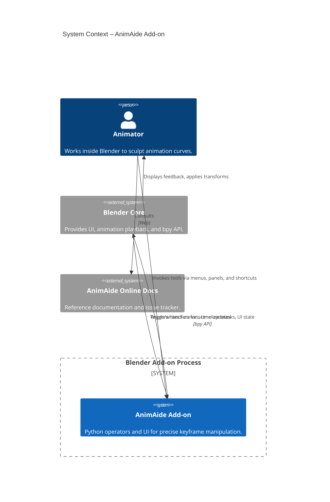
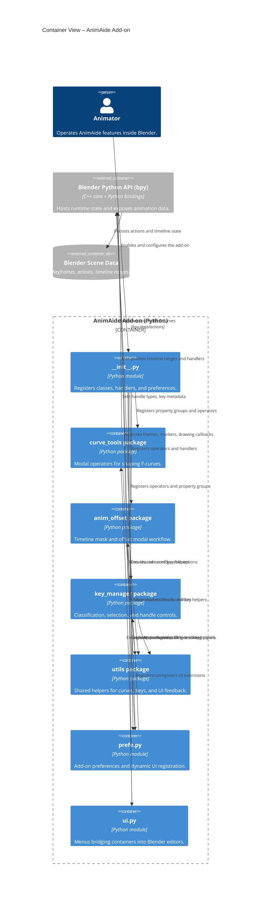
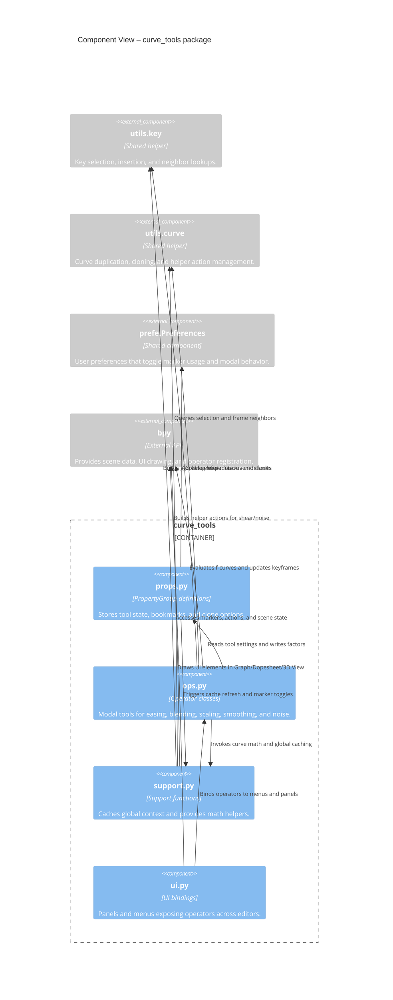

# AnimAide C4 Architecture

## Purpose & Scope
AnimAide is a Blender add-on that augments keyframe editing with reusable tools for curve shaping, key management, and non-destructive animation offsets. This document captures the system-level structure using the C4 model so designers and maintainers can reason about integration points, module responsibilities, and runtime behavior.

## Codebase Landmarks

- `scripts/addons/animaide/__init__.py` is the activation entry point; it registers property groups, operators, menus, and Blender event handlers.
- `scripts/addons/animaide/curve_tools` provides modal operators and UI for sculpting f-curves, along with the supporting math and state containers.
- `scripts/addons/animaide/anim_offset` implements the timeline mask workflow and modal handlers that react to user transforms in real time.
- `scripts/addons/animaide/key_manager` centralises key classification, handle adjustments, and frame spacing utilities.
- `scripts/addons/animaide/prefe.py` exposes add-on preferences that dynamically register header/panel variants across Blender editors.
- `scripts/addons/animaide/utils` supplies shared helpers for curve cloning, key selection, UI feedback, and theme manipulation.

## Level 1 – System Context

The add-on executes inside Blender and is operated directly by animators. It relies on Blender's Python API to reach scene data and to receive timeline/handler callbacks.

## Level 2 – Container View

AnimAide is delivered as a single Python package that is decomposed into specialised sub-packages. Most containers collaborate through the shared utilities layer and communicate with Blender through the `bpy` API.

## Level 3 – Component View (curve_tools)

The `curve_tools` container contributes the densest runtime surface. It owns the modal operators that edit values in place, backed by property groups and support utilities that maintain global caches and helper curves.

## Runtime Interaction Highlights

- `scripts/addons/animaide/__init__.py::register` attaches `load_post_handler` and installs menu entries so the add-on can react when a scene is loaded.
- `anim_offset/ops.py::ANIMAIDE_OT_add_anim_offset_mask.modal` continuously updates the timeline mask while the user drags, relying on `anim_offset.support.set_blend_values` to sync the helper curve.
- `curve_tools/ops.py::ANIMAIDE_OT_ease_to_ease.execute` delegates to `curve_tools.support.to_execute`, which orchestrates per-object caching and invokes the tool callback for every affected f-curve.
- `key_manager/ops.py::AAT_OT_set_handles_type.execute` feeds through `key_manager.support.set_handles_type`, ensuring handle adjustments obey the active UI context and selection filters.

## Design Considerations & Risks

- Global caches in `curve_tools.support.global_values` and handler-installed state in `anim_offset.support` demand careful lifecycle management to avoid stale references when Blender scenes change unexpectedly.
- UI placement is configurable at runtime through `prefe.py`; new panels or menus must register and unregister conditionally, otherwise Blender can throw duplicate class registration errors.
- Modal operators such as `ANIMAIDE_OT_add_anim_offset_mask` assume the host area (Graph Editor, Dope Sheet, or 3D View) remains valid. Additional guards may be required when Blender switches contexts mid-operation.
- Utilities under `utils.general` temporarily modify theme colors and UI handlers; extensions should restore defaults through `utils.reset_bar_color` to avoid leaking UI state across sessions.
